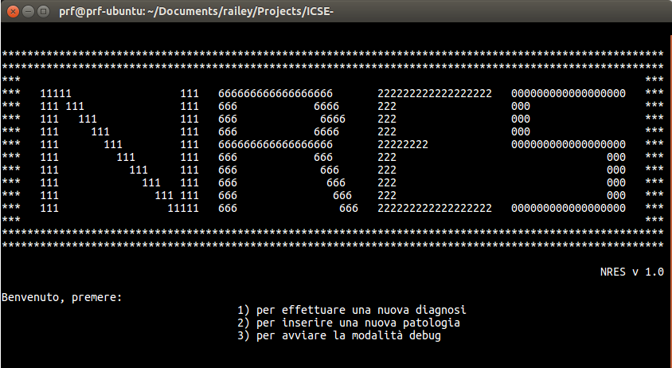

# ICSE-NRES
Naive Raspelli Expert System (NRES) is a Rule Based Expert System for grapevine diseases diagnosys developed in CLIPS as project for Knowledge Engineering and Expert System course (CS department @Uniba). 

Additional info about system design and development could be found in the *guida_utente.pdf* and *documentazione.pdf* (Italian language)

## Warning
NRES needs NRES-FuzzyCLIPS to run. [NRES-FuzzyCLIPS](https://github.com/PRFina/NRES-FuzzyClips)  is a custom extension of FuzzyCLIPS 6.31 
